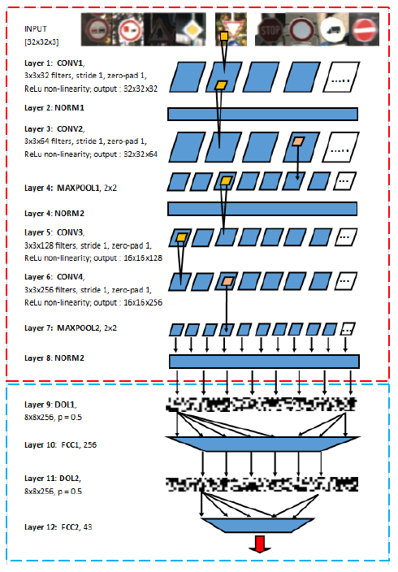

# Federated Neural Network for Traffic Sign Recognition

This repository contains the backup of the Master's thesis work by Federico Zanetti, titled "Federated Neural Network for Traffic Sign Recognition", completed in 2016 at the University of Trento (UNITN).

## Overview

The project explores federated learning techniques applied to traffic sign recognition using the German Traffic Sign Recognition Benchmark (GTSRB) dataset. The implementation includes various federated neural network architectures and evaluation methods.

## Dataset

The project uses the GTSRB dataset, which consists of:
- 43 classes of traffic signs
- Training set with track-based organization
- Test set for final evaluation
- Images in PPM format with annotations

## Code Structure

- `source/`: Python scripts for federated learning implementations
  - `fedenet_original.py`: Base federated neural network
  - `fedenet_features_cleanup.py`: Feature-based federated learning
  - `fedenet_grayscale.py`: Grayscale image processing
  - Cross-fold validation scripts
  - Demo and utility scripts

- `DATASETS/`: Dataset organization
  - `Full_set1/`: Complete GTSRB training set
  - `cross_fold_GTSRB/`: Cross-validation folds
  - `cross_fold_segmented/`: Segmented data for cross-validation
  - `DATABASE_segmented-24_/`: Segmented database

- `Weights/`: Trained model weights and results
  - `CS1-raw/`: Raw federated learning results
  - `CS2-patch/`: Patch-based approach results
  - `CS3-segm/`: Segmentation-based results

- `docs/`: Documentation and additional resources

## Documentation

### Architecture Diagram

This diagram illustrates the convolutional neural network architecture used in the federated learning implementation.

- Federated learning implementation for privacy-preserving distributed training
- Multiple architectural variants (raw, patch-based, segmented)
- Cross-validation evaluation
- Confusion matrix analysis
- Performance comparison across different approaches

## Requirements

- Python (version used in 2016)
- NumPy
- OpenCV (for image processing)
- Neural network libraries (likely Theano or TensorFlow based on the era)

## Usage

The scripts in `source/` can be run individually for different experiments. Refer to the thesis document for detailed methodology and results.

## Results

The thesis achieved high accuracy on the GTSRB dataset using federated learning approaches, with detailed analysis in the confusion matrices and performance metrics stored in the `Weights/` directory.

## Thesis Document

The full thesis is available as `UNITN_Federico_Zanetti_MSC_Thesis_2016.pdf`.

## Citation

If you use this work, please cite:
Federico Zanetti. "Federated Neural Network for Traffic Sign Recognition". Master's Thesis, University of Trento, 2016.</content>
<parameter name="filePath">d:\Documenti_221015\Università_TRENTO\THESIS_BACKUP\README.md